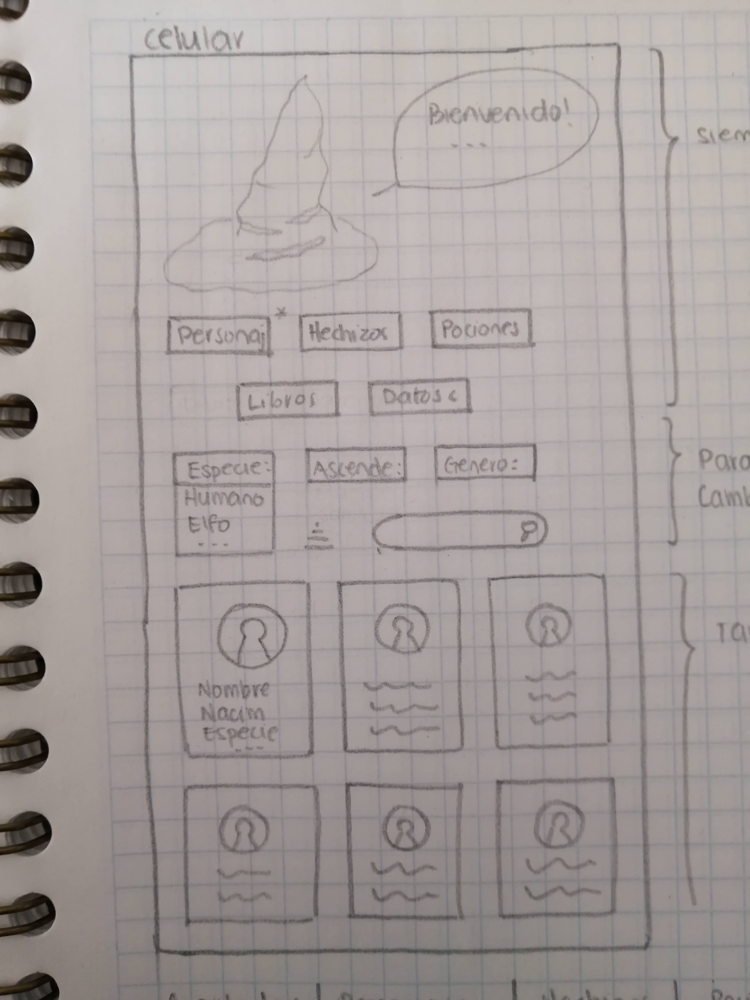

**Definición del producto**

Para nuestro proyecto escogimos el tema de Harry Potter. Nuestra página le permite al usuario visualizar todos los personajes que aparecen en todos los libros de la saga, también le permite filtrar por género y por casa a la que pertenece. Para facilitar la búsqueda de algún personaje se agregó una barra de búsqueda y un botón para limpiar los filtros. Al hacer uso de algún filtro, se indica la cantidad de personajes que cumplen con esa condición.

**Historias de Usuarios**

| Historia de usuario 1 (Personajes)   | Criterios de aceptación |
| :------------ |:---------------:
| Yo como usuario, .      | Tener visibles las opciones para escoger entre diferentes filtros | 
|Quiero poder ver la información de los personajes, género y casa    | **Definición de terminado**        |
| para que sea más fácil encontrar algún personaje. | Al seleccionar el filtro muestre los resultados deseados       |

| Historia de usuario 2 (Casas)   | Criterios de aceptación |
| :------------ |:---------------:
| Yo como usuario,     | Que se vea cada casa y la cantidad de estudiantes de cada una | 
| quiero saber cuantos estudiantes hay por casa     | **Definición de terminado**        |
| Para saber cual es la más popular. | Cuando el usuario filtre por casa aparecerá el número de estudiantes de cada casa.       |

| Historia de usuario 3  | Criterios de aceptación |
| :------------ |:---------------:
| Yo como usuario que no conoce mucho de HP     | Poder ver los libros acomodados por fecha de publicación de estudiantes de cada una | 
| quiero poder ver cuantos y cuales son los libros que hay     | **Definición de terminado**        |
| para poder leerlos todos en orden. | - Que aparezcan los libros en orden por fecha de publicación  -Filtrar data para mostrar solo libros  |

**Sketches baja fidelidad**

